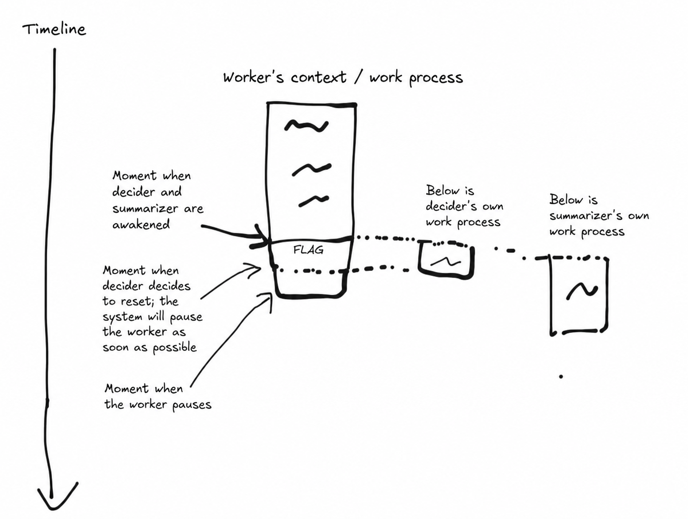
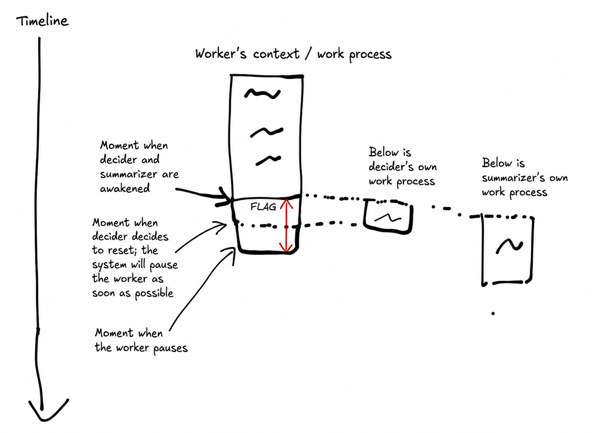

[中文版本](README_zh.md)
# Memory Mechanism Explained

The core of this agent system is the memory mechanism: task execution and memory management are separated. The system has three roles: `worker` (does the work), `summarizer` (writes summaries), and `decider` (decides whether to reset the context).

This design is based on two ideas:
1. Splitting responsibilities reduces the AI's attention burden, which usually leads to better results. This is one of the basic principles of AI engineering.
2. Human memory also works this way to a large extent: summarization and resetting happen in the background automatically.

It is worth first skimming `backend/src/core/init_prompts.py` in `_build_codex_user_level_instruction`, and `backend/src/core/memory_manager.py` in `build_summarizer_instruction` and `build_decider_instruction`, just to build a rough mental model.

Every time the worker's context grows by 3%, the system automatically forks a summarizer and a decider from the worker's context (using cache). The worker does not pause and keeps running, similar to how the human brain works. This design introduces some problems, which will be discussed later.

After the summarizer is forked, the system leaves a `WAKE_SUMMARIZER_FLAG` in the worker's context. Note that this happens **after** the fork, so the newly forked summarizer does not see that flag in its own context. The flag is meant for the **next** summarizer wake-up. Its exact purpose is explained in `build_summarizer_instruction`.

One edge case: if the previous summarizer has not finished yet and the next summarizer trigger point is reached, the system should not start another summarizer immediately. It should wait until the next trigger instead.

When the system detects that the decider has decided to reset the context, it pauses the worker as soon as possible, specifically after the worker finishes the current tool call and the system appends the tool message.





The part marked by the red line has not been summarized yet, so it must be carried into the new context. The original design considered triggering one more summary. In practice, the decider usually does not need much time to make the decision, and during that interval the worker's context usually does not grow much, so triggering another summary is a bit wasteful even with cache.

If the decider emits the reset signal while the summarizer is still running, the decider has to wait until the summarizer finishes.

Can we wait until the decider decides to reset and only then summarize, to save tokens? In theory yes. I used to do that in Codex (`gpt5.2`) as well: only ask it to summarize once I believed a reset was needed. But in practice it tended to miss things.

Maybe a year from now, when large-model prices have dropped significantly, this can be adjusted so that the worker wakes the summarizer and decider every five turns, or even wakes the summarizer every single turn, as frequently as the human brain does.

# Suggested Reading Order

1. `backend/src/core/init_prompts.py` and `backend/src/core/memory_manager.py`
2. `backend/src/core/agent.py`. In PyCharm, use Structure; in VS Code, use Outline to see which public interfaces `Agent` exposes. The core is `run()`.
3. `backend/src/core/agent_runner.py`: mainly exists to support the steer-conversation feature, making sure only one agent is running even when multiple steer messages come in, so re-entrancy does not happen.
4. `backend/src/web_app.py`
5. `backend/src/websocket_chat_session.py`

# Documents

- `AGENTS.md` roughly describes the structure of the project.
- `docs/feature-decisions.md`: product feature decisions
- `docs/draft-plans`: my initial plans
- `docs/plans`: plans written by AI based on those initial plans
- `docs/code_explanations`: code explanations generated for me by AI. They are probably not very useful for other people. They were made with the [structured-knowledge](https://github.com/jenglong1899/structured-knowledge) skill.

# Start

The default setup uses a Codex subscription. If you want to use something else, set the environment variables first.

```bash
cd backend
cp .env.example .env
```

Linux/macOS:

```bash
chmod +x dev.sh
./dev.sh
```

If you use Codex, you may need to set an environment variable for a proxy. PyCharm run configurations do not expand literal values inside environment variables, which can break the proxy setup.

You can set this environment variable directly in the run configuration:
- key: `BIONIC_BOT_CODEX_HTTP_PROXY`
- value: `socks5h://172.17.16.1:7890` (if your VPN uses port `7890`)
